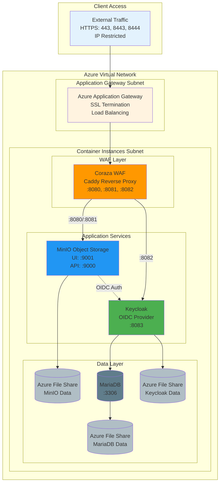

# MinIO Azure Container App

This repository provides both **local development** and **Azure production deployment** for MinIO object storage with Keycloak SSO authentication, Coraza WAF protection, and opkssh SSH certificate authentication.

---

## 🚀 Quick Start

### Local Development
For local testing and development:

```bash
cd docker-compose
./setup-local.sh
```

See [docker-compose/README.md](docker-compose/README.md) for complete local development documentation.

### Azure Deployment
For production deployment to Azure:

```bash
terraform init
terraform plan
terraform apply
```

See [Terraform Usage](#terraform-deployment) below for details.

---

## 📁 Repository Structure

```
.
├── docker-compose/           # Local development environment
│   ├── README.md            # Complete local dev documentation
│   ├── setup-local.sh       # Automated local setup
│   └── ...                  # Docker Compose configuration
│
├── main.tf                  # Terraform Azure deployment
├── variables.tf             # Terraform variables
├── outputs.tf              # Terraform outputs
└── README.md               # This file
```

---

## 🏗️ Architecture

### Azure Production Architecture



---

## 🧩 Components

### Core Services
* **MinIO**: S3-compatible object storage with OIDC authentication
* **Keycloak**: Enterprise identity and access management
* **MariaDB**: Database backend for Keycloak
* **Coraza WAF**: OWASP Core Rule Set protection with rate limiting

### Azure Infrastructure
* **Application Gateway**: SSL termination, load balancing, IP restrictions (ports 443/8443/8444)
* **Network Security Group**: IP-based access control
* **Azure File Shares**: Persistent storage for MinIO, MariaDB, and Keycloak data
* **Virtual Network**: Network isolation with dedicated subnets
* **Key Vault**: Secure certificate storage

### Additional Features
* **opkssh**: SSH certificate-based authentication using OIDC (local development only)

---

## 🛠️ Terraform Deployment

### Prerequisites

* Azure Subscription
* Terraform >= 1.0
* Azure CLI (logged in)

### Variables

Create a `terraform.tfvars` file from the example:

```bash
cp terraform.tfvars.example terraform.tfvars
# Edit terraform.tfvars with your values
```

**Minimum required variables:**

```hcl
resource_group_name      = "minio-production"
public_url_domain_name   = "minio-prod"
minio_root_password      = "your-secure-password"
keycloak_admin_password  = "your-keycloak-admin-password"
allowed_ip_addresses     = "203.0.113.0/32,198.51.100.0/24"
```

See `terraform.tfvars.example` for all available options.

### Deployment

```bash
terraform init
terraform plan
terraform apply
```

### Outputs

After deployment, Terraform provides:
- **console_url**: MinIO web console URL
- **s3_api_url**: MinIO S3 API endpoint  
- **keycloak_url**: Keycloak admin console
- **fqdn**: Fully qualified domain name
- **mc_alias_command**: MinIO client configuration command
- **certificate_download_command**: Download self-signed certificate

---

## 🌐 Accessing Services (Azure)

### MinIO Web Console
```
https://your-domain.azurecontainer.io/
```
Login with:
- **Root credentials**: Configured via `minio_root_user` and `minio_root_password`
- **SSO**: Click "Login with SSO" for Keycloak authentication

### MinIO S3 API
```
https://your-domain.azurecontainer.io:8443/
```

### Keycloak Admin Console
```
https://your-domain.azurecontainer.io:8444/
```

Default realm: `minio_realm`
- Admin user: `admin` (password from `keycloak_admin_password`)
- Test user: `testuser` / `test@test.com`

### MinIO Client Setup

```bash
# Get the setup command from Terraform output
terraform output -raw mc_alias_command

# Or manually configure
mc alias set myminio https://your-fqdn.azurecontainer.io:8443 minioadmin your-password

# Download certificate if needed
terraform output -raw certificate_pem > minio-cert.pem
```

---

## 🔒 Security Features

### WAF Protection (Coraza + OWASP CRS)
* OWASP Core Rule Set v4
* SQL injection prevention
* XSS protection
* Command injection blocking
* Path traversal prevention
* Rate limiting per source IP
* Audit logging

### Infrastructure Security
* **IP Restrictions**: NSG rules limit access to specified IPs
* **SSL Termination**: Azure Application Gateway encrypts all traffic
* **Network Isolation**: Dedicated VNet with subnet segmentation
* **Internal Communication**: Container-to-container traffic stays within group
* **Certificate Storage**: Azure Key Vault for SSL certificates
* **No Direct Access**: MinIO/Keycloak ports not exposed externally

---

## 📦 Azure Resources Created

* **Application Gateway**: SSL termination, load balancing (ports 443, 8443, 8444)
* **Virtual Network**: Network isolation with Application Gateway + Container Instance subnets
* **Network Security Group**: IP-based access restrictions
* **Container Group**: Hosts MinIO, Keycloak, MariaDB, and Coraza WAF
* **Storage Account**: Persistent storage backend
* **Storage Shares**: Separate shares for MinIO, MariaDB, and Keycloak data
* **Key Vault**: Secure certificate storage
* **Log Analytics Workspace**: Monitoring and diagnostics

---

## 📚 Additional Documentation

- [docker-compose/README.md](docker-compose/README.md) - Complete local development guide
- [README-coraza.md](README-coraza.md) - Coraza WAF container documentation
- [Terraform Variables](#inputs) - Complete variable reference below

---

<!-- BEGIN_TF_DOCS -->
## Requirements

| Name | Version |
|------|---------|
| <a name="requirement_azurerm"></a> [azurerm](#requirement\_azurerm) | 4.36.0 |
| <a name="requirement_random"></a> [random](#requirement\_random) | ~> 3.1 |

## Modules

No modules.

## Resources

| Name | Type |
|------|------|
| [azurerm_application_gateway.minio_agw](https://registry.terraform.io/providers/hashicorp/azurerm/4.36.0/docs/resources/application_gateway) | resource |
| [azurerm_container_group.minio_aci_container_group](https://registry.terraform.io/providers/hashicorp/azurerm/4.36.0/docs/resources/container_group) | resource |
| [azurerm_key_vault.minio_kv](https://registry.terraform.io/providers/hashicorp/azurerm/4.36.0/docs/resources/key_vault) | resource |
| [azurerm_key_vault_access_policy.agw_policy](https://registry.terraform.io/providers/hashicorp/azurerm/4.36.0/docs/resources/key_vault_access_policy) | resource |
| [azurerm_key_vault_access_policy.minio_cert_policy](https://registry.terraform.io/providers/hashicorp/azurerm/4.36.0/docs/resources/key_vault_access_policy) | resource |
| [azurerm_key_vault_certificate.minio_cert](https://registry.terraform.io/providers/hashicorp/azurerm/4.36.0/docs/resources/key_vault_certificate) | resource |
| [azurerm_log_analytics_workspace.minio_law](https://registry.terraform.io/providers/hashicorp/azurerm/4.36.0/docs/resources/log_analytics_workspace) | resource |
| [azurerm_network_security_group.agw_nsg](https://registry.terraform.io/providers/hashicorp/azurerm/4.36.0/docs/resources/network_security_group) | resource |
| [azurerm_network_security_rule.allow_agw_management](https://registry.terraform.io/providers/hashicorp/azurerm/4.36.0/docs/resources/network_security_rule) | resource |
| [azurerm_network_security_rule.allow_azureloadbalancer](https://registry.terraform.io/providers/hashicorp/azurerm/4.36.0/docs/resources/network_security_rule) | resource |
| [azurerm_network_security_rule.allow_https_api](https://registry.terraform.io/providers/hashicorp/azurerm/4.36.0/docs/resources/network_security_rule) | resource |
| [azurerm_network_security_rule.allow_https_keycloak](https://registry.terraform.io/providers/hashicorp/azurerm/4.36.0/docs/resources/network_security_rule) | resource |
| [azurerm_network_security_rule.allow_https_ui](https://registry.terraform.io/providers/hashicorp/azurerm/4.36.0/docs/resources/network_security_rule) | resource |
| [azurerm_network_security_rule.deny_all](https://registry.terraform.io/providers/hashicorp/azurerm/4.36.0/docs/resources/network_security_rule) | resource |
| [azurerm_public_ip.agw_pip](https://registry.terraform.io/providers/hashicorp/azurerm/4.36.0/docs/resources/public_ip) | resource |
| [azurerm_resource_group.minio_rg](https://registry.terraform.io/providers/hashicorp/azurerm/4.36.0/docs/resources/resource_group) | resource |
| [azurerm_storage_account.minio_storage_account](https://registry.terraform.io/providers/hashicorp/azurerm/4.36.0/docs/resources/storage_account) | resource |
| [azurerm_storage_share.keycloak_share](https://registry.terraform.io/providers/hashicorp/azurerm/4.36.0/docs/resources/storage_share) | resource |
| [azurerm_storage_share.mariadb_share](https://registry.terraform.io/providers/hashicorp/azurerm/4.36.0/docs/resources/storage_share) | resource |
| [azurerm_storage_share.minio_share](https://registry.terraform.io/providers/hashicorp/azurerm/4.36.0/docs/resources/storage_share) | resource |
| [azurerm_subnet.aci_subnet](https://registry.terraform.io/providers/hashicorp/azurerm/4.36.0/docs/resources/subnet) | resource |
| [azurerm_subnet.agw_subnet](https://registry.terraform.io/providers/hashicorp/azurerm/4.36.0/docs/resources/subnet) | resource |
| [azurerm_subnet_network_security_group_association.agw_nsg_association](https://registry.terraform.io/providers/hashicorp/azurerm/4.36.0/docs/resources/subnet_network_security_group_association) | resource |
| [azurerm_user_assigned_identity.agw_identity](https://registry.terraform.io/providers/hashicorp/azurerm/4.36.0/docs/resources/user_assigned_identity) | resource |
| [azurerm_virtual_network.minio_vnet](https://registry.terraform.io/providers/hashicorp/azurerm/4.36.0/docs/resources/virtual_network) | resource |
| [random_password.keycloak_client_secret](https://registry.terraform.io/providers/hashicorp/random/latest/docs/resources/password) | resource |
| [random_password.mariadb_password](https://registry.terraform.io/providers/hashicorp/random/latest/docs/resources/password) | resource |
| [random_string.storage_suffix](https://registry.terraform.io/providers/hashicorp/random/latest/docs/resources/string) | resource |
| [azurerm_client_config.current](https://registry.terraform.io/providers/hashicorp/azurerm/4.36.0/docs/data-sources/client_config) | data source |

## Inputs

| Name | Description | Type | Default | Required |
|------|-------------|------|---------|:--------:|
| <a name="input_allowed_ip_addresses"></a> [allowed\_ip\_addresses](#input\_allowed\_ip\_addresses) | Comma-separated list of IP addresses that will be allowed to access the MinIO service in CIDR format. Example: '203.0.113.0/32' for a single IP or '10.10.10.2/32,192.168.1.0/24' for multiple IPs. | `string` | `"10.10.10.2/32"` | no |
| <a name="input_coraza_waf_image"></a> [coraza\_waf\_image](#input\_coraza\_waf\_image) | Coraza WAF container image | `string` | `"ghcr.io/meshcloud/minio_azure_container_app/coraza-caddy:caddy-2.8-coraza-v2.0.0"` | no |
| <a name="input_keycloak_admin_password"></a> [keycloak\_admin\_password](#input\_keycloak\_admin\_password) | Keycloak admin password | `string` | n/a | yes |
| <a name="input_keycloak_admin_user"></a> [keycloak\_admin\_user](#input\_keycloak\_admin\_user) | Keycloak admin username | `string` | `"admin"` | no |
| <a name="input_keycloak_test_user_email"></a> [keycloak\_test\_user\_email](#input\_keycloak\_test\_user\_email) | Keycloak test user email | `string` | `"test@test.com"` | no |
| <a name="input_keycloak_test_user_password"></a> [keycloak\_test\_user\_password](#input\_keycloak\_test\_user\_password) | Keycloak test user password | `string` | `"password"` | no |
| <a name="input_keycloak_test_user_username"></a> [keycloak\_test\_user\_username](#input\_keycloak\_test\_user\_username) | Keycloak test user username | `string` | `"testuser"` | no |
| <a name="input_location"></a> [location](#input\_location) | Azure region for deployment | `string` | `"germanywestcentral"` | no |
| <a name="input_mariadb_database"></a> [mariadb\_database](#input\_mariadb\_database) | MariaDB database name for Keycloak | `string` | `"mariadb"` | no |
| <a name="input_mariadb_user"></a> [mariadb\_user](#input\_mariadb\_user) | MariaDB username | `string` | `"keycloak"` | no |
| <a name="input_minio_image"></a> [minio\_image](#input\_minio\_image) | MinIO container image | `string` | `"quay.io/minio/minio:RELEASE.2025-04-22T22-12-26Z"` | no |
| <a name="input_minio_root_password"></a> [minio\_root\_password](#input\_minio\_root\_password) | MinIO root password for admin access | `string` | n/a | yes |
| <a name="input_minio_root_user"></a> [minio\_root\_user](#input\_minio\_root\_user) | MinIO root username for admin access | `string` | `"minioadmin"` | no |
| <a name="input_nginx_image"></a> [nginx\_image](#input\_nginx\_image) | Nginx container image | `string` | `"mcr.microsoft.com/azurelinux/base/nginx:1.25"` | no |
| <a name="input_opkssh_redirect_uris"></a> [opkssh\_redirect\_uris](#input\_opkssh\_redirect\_uris) | OpenPubkey SSH client redirect URIs for local development | `list(string)` | <pre>[<br/>  "http://localhost:3000/login-callback",<br/>  "http://localhost:10001/login-callback",<br/>  "http://localhost:11110/login-callback"<br/>]</pre> | no |
| <a name="input_public_url_domain_name"></a> [public\_url\_domain\_name](#input\_public\_url\_domain\_name) | Domain name for the public URL (e.g., 'miniotest' creates 'miniotest.westeurope.azurecontainer.io') | `string` | n/a | yes |
| <a name="input_resource_group_name"></a> [resource\_group\_name](#input\_resource\_group\_name) | Name of the Resource Group where you want to deploy MinIO | `string` | n/a | yes |
| <a name="input_storage_account_name"></a> [storage\_account\_name](#input\_storage\_account\_name) | Storage Account Name prefix (random suffix will be added for global uniqueness) | `string` | `"miniostorage"` | no |
| <a name="input_storage_share_size"></a> [storage\_share\_size](#input\_storage\_share\_size) | Storage space needed in GBs (minimum 1GB, maximum 5120GB/5TB) | `number` | `100` | no |

## Outputs

| Name | Description |
|------|-------------|
| <a name="output_certificate_download_command"></a> [certificate\_download\_command](#output\_certificate\_download\_command) | Command to download certificate locally |
| <a name="output_certificate_pem"></a> [certificate\_pem](#output\_certificate\_pem) | Self-signed certificate in PEM format (public cert) |
| <a name="output_console_url"></a> [console\_url](#output\_console\_url) | MinIO Web Console URL |
| <a name="output_fqdn"></a> [fqdn](#output\_fqdn) | Fully qualified domain name |
| <a name="output_keycloak_client_secret"></a> [keycloak\_client\_secret](#output\_keycloak\_client\_secret) | Generated Keycloak OIDC client secret for MinIO |
| <a name="output_keycloak_url"></a> [keycloak\_url](#output\_keycloak\_url) | Keycloak admin console URL |
| <a name="output_mc_alias_command"></a> [mc\_alias\_command](#output\_mc\_alias\_command) | MinIO client setup command |
| <a name="output_public_ip"></a> [public\_ip](#output\_public\_ip) | Public IP address |
| <a name="output_s3_api_url"></a> [s3\_api\_url](#output\_s3\_api\_url) | MinIO S3 API endpoint |
| <a name="output_storage_account_name"></a> [storage\_account\_name](#output\_storage\_account\_name) | Azure Storage Account name |
<!-- END_TF_DOCS -->
