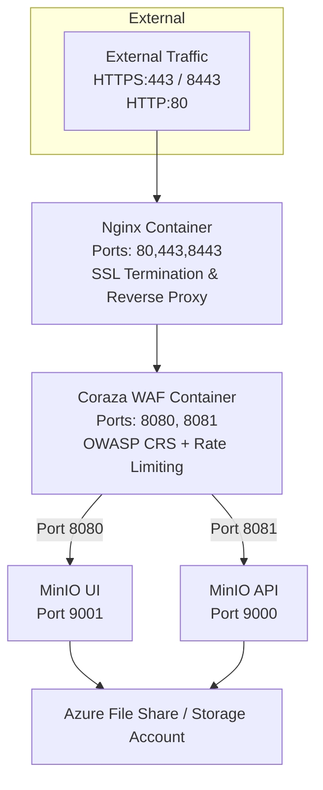

# MinIO Azure Container App

This repo deploys a MinIO Container to an **Azure Container Group** with nginx for SSL termination and Coraza WAF for comprehensive security protection.

---

## Architecture



---

## Components

* **MinIO Container**: Runs the object storage service (ports 9000/9001 - internal only)
* **nginx Container**: Provides SSL termination and reverse proxy (ports 80/443/8443 - externally exposed)
* **Coraza WAF Container**: Modern WAF with OWASP Core Rule Set protecting both UI (8080) and API (8081)
* **Storage**: Uses Azure File Share for persistent data storage

---

## Requirements

* Azure Subscription
* Azure Resource Group
* SSL Certificate (.pfx file) for HTTPS traffic
* OpenSSL (for certificate extraction)

---

## Creating the PFX Certificate

1. **Generate a private key:**

   ```bash
   openssl genrsa -out server.key 2048
   ```

2. **Create a certificate signing request (CSR):**

   ```bash
   openssl req -new -key server.key -out server.csr
   ```

   Ensure the Common Name matches your domain.

3. **Generate a self-signed certificate (or use a CA-signed certificate):**

   ```bash
   openssl x509 -req -days 365 -in server.csr -signkey server.key -out server.crt
   ```

4. **Create the PFX file:**

   ```bash
   openssl pkcs12 -export -out minio-cert.pfx -inkey server.key -in server.crt
   ```

5. **Extract certificate and key from PFX:**

   ```bash
   openssl pkcs12 -in minio-cert.pfx -clcerts -nokeys -out server.crt -passin pass:YOUR_PFX_PASSWORD
   openssl pkcs12 -in minio-cert.pfx -nocerts -nodes -out server.key -passin pass:YOUR_PFX_PASSWORD
   ```

---

## Usage

### Accessing MinIO

**Web Console (UI):**

```
https://your-domain.region.azurecontainer.io/
```

**S3 API (for applications/tools):**

```
https://your-domain.region.azurecontainer.io:8443/
```

### Using MinIO Client (mc)

1. **Install MinIO Client:**

   ```bash
   # macOS
   brew install minio/stable/mc

   # Linux
   wget https://dl.min.io/client/mc/release/linux-amd64/mc
   chmod +x mc
   ```

2. **Configure MinIO Client:**

   ```bash
   mc alias set myminio https://your-domain.region.azurecontainer.io:8443 your-username your-password --insecure
   ```

3. **Create and manage buckets:**

   ```bash
   mc mb myminio/my-bucket
   mc ls myminio
   mc cp myfile.txt myminio/my-bucket/
   mc cp myminio/my-bucket/myfile.txt ./
   ```

### Using AWS CLI

```bash
aws s3 ls --endpoint-url https://your-domain.region.azurecontainer.io:8443 --no-verify-ssl
```

---

## Resources Created

* **Container Group**: Hosts MinIO and nginx containers
* **Storage Account**: Provides persistent storage
* **Storage Share**: Azure File Share for MinIO data
* **Log Analytics Workspace**: For monitoring and logs
* **Network Security**: All MinIO ports are internal-only, external access via nginx SSL proxy

---

## Security Features

### WAF Protection (Coraza + OWASP CRS)
* **OWASP Core Rule Set**: Complete protection against OWASP Top 10 vulnerabilities
* **SQL Injection Prevention**: Blocks malicious database queries
* **XSS Protection**: Prevents cross-site scripting attacks
* **Command Injection Blocking**: Stops OS command execution attempts
* **Path Traversal Prevention**: Blocks directory traversal attacks

### Rate Limiting (Per Source IP)
* **MinIO UI**: 100 GET/min, 20 PUT/min, 10 POST/min
* **MinIO S3 API**: 200 GET/min, 50 PUT/min, 10 DELETE/min
* **Admin Endpoint Blocking**: Complete access denial to `/minio/admin`

### Infrastructure Security
* **SSL Termination**: All traffic encrypted via nginx
* **No Direct MinIO Access**: MinIO ports not exposed externally
* **Certificate-based Authentication**: Uses SSL certificates for secure connections
* **Internal Communication**: Containers communicate via localhost within the container group
* **Audit Logging**: All WAF actions logged for security monitoring

<!-- BEGIN_TF_DOCS -->
## Requirements

| Name | Version |
|------|---------|
| <a name="requirement_azurerm"></a> [azurerm](#requirement\_azurerm) | 4.36.0 |

## Modules

No modules.

## Resources

| Name | Type |
|------|------|
| [azurerm_container_group.minio_aci_container_group](https://registry.terraform.io/providers/hashicorp/azurerm/4.36.0/docs/resources/container_group) | resource |
| [azurerm_log_analytics_workspace.minio_law](https://registry.terraform.io/providers/hashicorp/azurerm/4.36.0/docs/resources/log_analytics_workspace) | resource |
| [azurerm_resource_group.minio_aci_rg](https://registry.terraform.io/providers/hashicorp/azurerm/4.36.0/docs/resources/resource_group) | resource |
| [azurerm_storage_account.minio_storage_account](https://registry.terraform.io/providers/hashicorp/azurerm/4.36.0/docs/resources/storage_account) | resource |
| [azurerm_storage_share.minio_storage_share](https://registry.terraform.io/providers/hashicorp/azurerm/4.36.0/docs/resources/storage_share) | resource |

## Inputs

| Name | Description | Type | Default | Required |
|------|-------------|------|---------|:--------:|
| <a name="input_cert_name"></a> [cert\_name](#input\_cert\_name) | Name of the SSL certificate file (e.g., minio-cert.pfx) | `string` | n/a | yes |
| <a name="input_cert_password"></a> [cert\_password](#input\_cert\_password) | Password for the SSL certificate | `string` | n/a | yes |
| <a name="input_containers"></a> [containers](#input\_containers) | Container specifications including images, CPU, and memory limits | <pre>object({<br>    minio = object({<br>      image        = string<br>      cpu          = string<br>      memory       = string<br>      cpu_limit    = number<br>      memory_limit = number<br>    })<br>    nginx = object({<br>      image        = string<br>      cpu          = string<br>      memory       = string<br>      cpu_limit    = number<br>      memory_limit = number<br>    })<br>    coraza_waf = object({<br>      image        = string<br>      cpu          = string<br>      memory       = string<br>      cpu_limit    = number<br>      memory_limit = number<br>    })<br>  })</pre> | <pre>{<br>  "coraza_waf": {<br>    "cpu": "1.0",<br>    "cpu_limit": 1,<br>    "image": "ghcr.io/meshcloud/minio_azure_container_app/coraza-caddy:caddy-2.8-coraza-v2.0.0",<br>    "memory": "1.0",<br>    "memory_limit": 2<br>  },<br>  "minio": {<br>    "cpu": "0.5",<br>    "cpu_limit": 1,<br>    "image": "quay.io/minio/minio:RELEASE.2025-09-07T16-13-09Z",<br>    "memory": "1.5",<br>    "memory_limit": 2<br>  },<br>  "nginx": {<br>    "cpu": "0.5",<br>    "cpu_limit": 1,<br>    "image": "mcr.microsoft.com/azurelinux/base/nginx:1.25",<br>    "memory": "1.0",<br>    "memory_limit": 2<br>  }<br>}</pre> | no |
| <a name="input_location"></a> [location](#input\_location) | Azure region for deployment | `string` | n/a | yes |
| <a name="input_minio_root_password"></a> [minio\_root\_password](#input\_minio\_root\_password) | MinIO root password for admin access | `string` | n/a | yes |
| <a name="input_minio_root_user"></a> [minio\_root\_user](#input\_minio\_root\_user) | MinIO root username for admin access | `string` | n/a | yes |
| <a name="input_public_url_domain_name"></a> [public\_url\_domain\_name](#input\_public\_url\_domain\_name) | Domain name for the public URL (e.g., 'miniotest' creates 'miniotest.westeurope.azurecontainer.io') | `string` | n/a | yes |
| <a name="input_resource_group_name"></a> [resource\_group\_name](#input\_resource\_group\_name) | Name of the Resource Group where you want to deploy MinIO | `string` | n/a | yes |
| <a name="input_storage_account_name"></a> [storage\_account\_name](#input\_storage\_account\_name) | Storage Account Name (must be globally unique across Azure) | `string` | n/a | yes |
| <a name="input_storage_share_size"></a> [storage\_share\_size](#input\_storage\_share\_size) | Storage space needed in GBs (minimum 1GB, maximum 5120GB/5TB) | `number` | n/a | yes |

## Outputs

| Name | Description |
|------|-------------|
| <a name="output_console_url"></a> [console\_url](#output\_console\_url) | MinIO Web Console URL |
| <a name="output_fqdn"></a> [fqdn](#output\_fqdn) | Fully qualified domain name |
| <a name="output_mc_alias_command"></a> [mc\_alias\_command](#output\_mc\_alias\_command) | MinIO client setup command |
| <a name="output_public_ip"></a> [public\_ip](#output\_public\_ip) | Public IP address |
| <a name="output_s3_api_url"></a> [s3\_api\_url](#output\_s3\_api\_url) | MinIO S3 API endpoint |
| <a name="output_storage_account_name"></a> [storage\_account\_name](#output\_storage\_account\_name) | Azure Storage Account name |
<!-- END_TF_DOCS -->