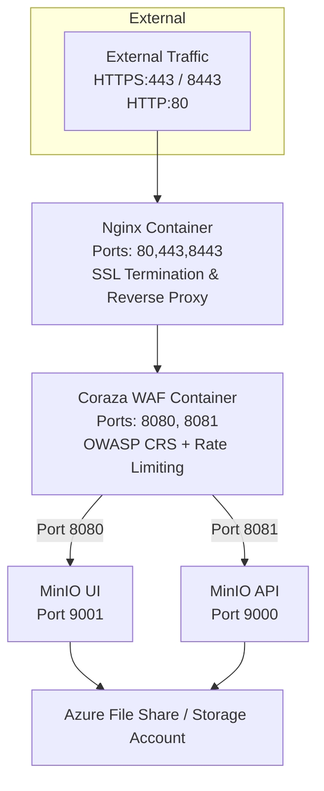

# MinIO Azure Container App

This repo deploys a MinIO Container to an **Azure Container Group** with nginx for SSL termination and Coraza WAF for comprehensive security protection.

---

## Architecture



---

## Components

* **MinIO Container**: Runs the object storage service (ports 9000/9001 - internal only)
* **nginx Container**: Provides SSL termination and reverse proxy (ports 80/443/8443 - externally exposed)
* **Coraza WAF Container**: Modern WAF with OWASP Core Rule Set protecting both UI (8080) and API (8081)
* **Storage**: Uses Azure File Share for persistent data storage

---

## Requirements

* Azure Subscription
* Azure Resource Group
* SSL Certificate (.pfx file) for HTTPS traffic
* OpenSSL (for certificate extraction)

---

## Creating the PFX Certificate

1. **Generate a private key:**

   ```bash
   openssl genrsa -out server.key 2048
   ```

2. **Create a certificate signing request (CSR):**

   ```bash
   openssl req -new -key server.key -out server.csr
   ```

   Ensure the Common Name matches your domain.

3. **Generate a self-signed certificate (or use a CA-signed certificate):**

   ```bash
   openssl x509 -req -days 365 -in server.csr -signkey server.key -out server.crt
   ```

4. **Create the PFX file:**

   ```bash
   openssl pkcs12 -export -out minio-cert.pfx -inkey server.key -in server.crt
   ```

5. **Extract certificate and key from PFX:**

   ```bash
   openssl pkcs12 -in minio-cert.pfx -clcerts -nokeys -out server.crt -passin pass:YOUR_PFX_PASSWORD
   openssl pkcs12 -in minio-cert.pfx -nocerts -nodes -out server.key -passin pass:YOUR_PFX_PASSWORD
   ```

---

## Usage

### Accessing MinIO

**Web Console (UI):**

```
https://your-domain.region.azurecontainer.io/
```

**S3 API (for applications/tools):**

```
https://your-domain.region.azurecontainer.io:8443/
```

### Using MinIO Client (mc)

1. **Install MinIO Client:**

   ```bash
   # macOS
   brew install minio/stable/mc

   # Linux
   wget https://dl.min.io/client/mc/release/linux-amd64/mc
   chmod +x mc
   ```

2. **Configure MinIO Client:**

   ```bash
   mc alias set myminio https://your-domain.region.azurecontainer.io:8443 your-username your-password --insecure
   ```

3. **Create and manage buckets:**

   ```bash
   mc mb myminio/my-bucket
   mc ls myminio
   mc cp myfile.txt myminio/my-bucket/
   mc cp myminio/my-bucket/myfile.txt ./
   ```

### Using AWS CLI

```bash
aws s3 ls --endpoint-url https://your-domain.region.azurecontainer.io:8443 --no-verify-ssl
```

---

## Resources Created

* **Container Group**: Hosts MinIO and nginx containers
* **Storage Account**: Provides persistent storage
* **Storage Share**: Azure File Share for MinIO data
* **Log Analytics Workspace**: For monitoring and logs
* **Network Security**: All MinIO ports are internal-only, external access via nginx SSL proxy

---

## Security Features

### WAF Protection (Coraza + OWASP CRS)
* **OWASP Core Rule Set**: Complete protection against OWASP Top 10 vulnerabilities
* **SQL Injection Prevention**: Blocks malicious database queries
* **XSS Protection**: Prevents cross-site scripting attacks
* **Command Injection Blocking**: Stops OS command execution attempts
* **Path Traversal Prevention**: Blocks directory traversal attacks

### Rate Limiting (Per Source IP)
* **MinIO UI**: 100 GET/min, 20 PUT/min, 10 POST/min
* **MinIO S3 API**: 200 GET/min, 50 PUT/min, 10 DELETE/min
* **Admin Endpoint Blocking**: Complete access denial to `/minio/admin`

### Infrastructure Security
* **SSL Termination**: All traffic encrypted via nginx
* **No Direct MinIO Access**: MinIO ports not exposed externally
* **Certificate-based Authentication**: Uses SSL certificates for secure connections
* **Internal Communication**: Containers communicate via localhost within the container group
* **Audit Logging**: All WAF actions logged for security monitoring
