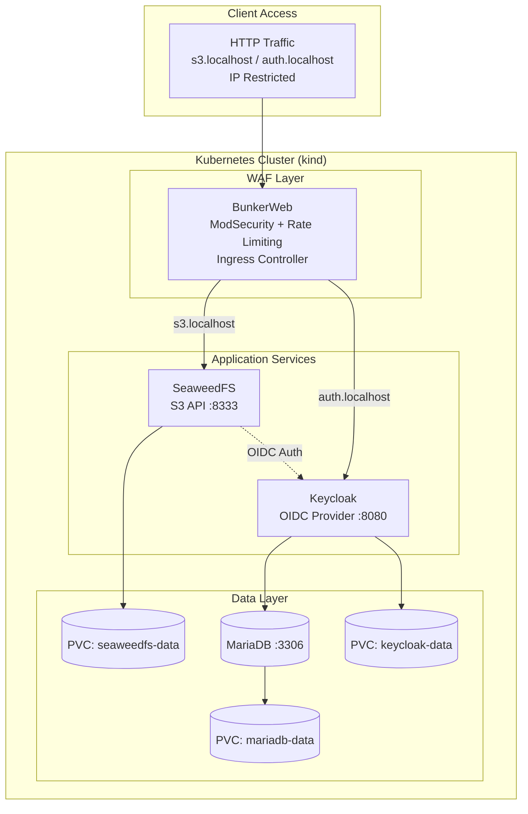
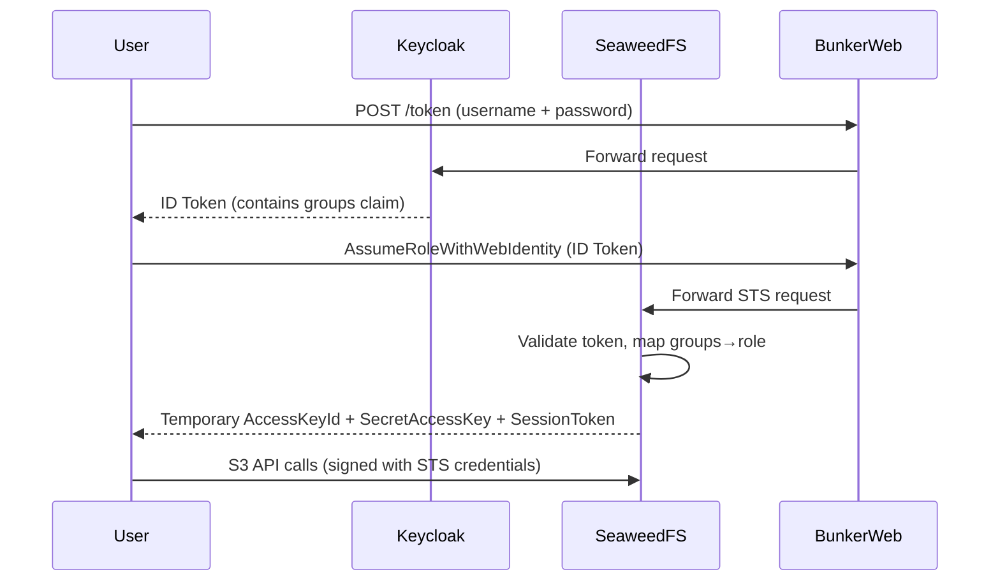

# SeaweedFS Kubernetes Deployment

S3-compatible object storage on Kubernetes (kind) with OIDC authentication (Keycloak), WAF protection (BunkerWeb), and opkssh SSH certificate authentication.

---

## Quick Start

```bash
kind create cluster --name seaweedfs
terraform init
terraform apply
```

### Local Testing Prerequisites

Port-forwards are needed for local access (kind doesn't expose ports 80/443 by default):

```bash
# Terminal 1: BunkerWeb (auth.localhost + s3.localhost via Host header)
kubectl port-forward svc/bunkerweb-external 8080:80

# Terminal 2: SeaweedFS direct (needed for AWS CLI, which can't send custom Host headers)
kubectl port-forward svc/seaweedfs-s3 18333:8333
```

Services are then available at:
- **S3 API**: `http://s3.localhost` (via BunkerWeb) or `http://localhost:18333` (direct)
- **Keycloak**: `http://auth.localhost` (via BunkerWeb)
- **Keycloak Admin**: `http://auth.localhost/admin` — `admin` / `admin`
- **Test User**: `testuser` / `password` (member of `developers` group)

---

## S3 Authentication Flow

SeaweedFS uses OIDC-based STS (Security Token Service) for S3 access. The flow is:

1. Authenticate with Keycloak to get an **ID token**
2. Exchange the ID token for **temporary S3 credentials** via STS `AssumeRoleWithWebIdentity`
3. Use the S3 credentials with the AWS CLI (or any S3 client)

### Manual Testing

```bash
# 1. Get client secret
CLIENT_SECRET=$(kubectl get secret keycloak-credentials -o jsonpath='{.data.client-secret}' | base64 -d)

# 2. Get ID token from Keycloak
ID_TOKEN=$(curl -s -X POST \
  -H "Host: auth.localhost" \
  "http://localhost:8080/realms/seaweedfs/protocol/openid-connect/token" \
  -d "grant_type=password" \
  -d "client_id=seaweedfs-client" \
  -d "client_secret=$CLIENT_SECRET" \
  -d "username=testuser" \
  -d "password=password" \
  -d "scope=openid" | jq -r '.id_token')

# 3. Exchange ID token for STS credentials
STS_RESULT=$(curl -s "http://localhost:8080" \
  -H "Host: s3.localhost" \
  --data-urlencode "Action=AssumeRoleWithWebIdentity" \
  --data-urlencode "WebIdentityToken=$ID_TOKEN" \
  --data-urlencode "RoleArn=arn:aws:iam::role/S3WriteRole" \
  --data-urlencode "RoleSessionName=testuser-session" \
  --data-urlencode "Version=2011-06-15")

# 4. Export credentials
export AWS_ACCESS_KEY_ID=$(echo "$STS_RESULT" | xmllint --xpath '//*[local-name()="AccessKeyId"]/text()' -)
export AWS_SECRET_ACCESS_KEY=$(echo "$STS_RESULT" | xmllint --xpath '//*[local-name()="SecretAccessKey"]/text()' -)
export AWS_SESSION_TOKEN=$(echo "$STS_RESULT" | xmllint --xpath '//*[local-name()="SessionToken"]/text()' -)

# 5. Use S3
aws --endpoint-url http://localhost:18333 s3 ls
aws --endpoint-url http://localhost:18333 s3 mb s3://my-bucket
aws --endpoint-url http://localhost:18333 s3 cp myfile.txt s3://my-bucket/
```

### Automated Test Script

```bash
./test-s3.sh
```

Runs the full flow: token acquisition, STS exchange, bucket create/upload/download/delete.

Requires both port-forwards to be running and `jq`, `xmllint`, and `aws` CLI installed.

---

## Architecture


```mermaid
graph TD
    subgraph "Client Access"
        Client[HTTP Traffic<br/>s3.localhost / auth.localhost<br/>IP Restricted]
    end

    subgraph "Kubernetes Cluster (kind)"
        subgraph "WAF Layer"
            BW[BunkerWeb<br/>ModSecurity + Rate Limiting<br/>Ingress Controller]
        end

        subgraph "Application Services"
            SeaweedFS[SeaweedFS<br/>S3 API :8333]
            Keycloak[Keycloak<br/>OIDC Provider :8080]
        end

        subgraph "Data Layer"
            MariaDB[(MariaDB :3306)]
            SeaweedPVC[(PVC: seaweedfs-data)]
            MariadbPVC[(PVC: mariadb-data)]
            KeycloakPVC[(PVC: keycloak-data)]
        end
    end

    Client --> BW
    BW -->|s3.localhost| SeaweedFS
    BW -->|auth.localhost| Keycloak
    SeaweedFS --> SeaweedPVC
    SeaweedFS -.OIDC Auth.-> Keycloak
    Keycloak --> MariaDB
    Keycloak --> KeycloakPVC
    MariaDB --> MariadbPVC
```

### Authentication Flow


```mermaid
sequenceDiagram
    participant User
    participant Keycloak
    participant SeaweedFS
    participant BunkerWeb

    User->>BunkerWeb: POST /token (username + password)
    BunkerWeb->>Keycloak: Forward request
    Keycloak-->>User: ID Token (contains groups claim)
    User->>BunkerWeb: AssumeRoleWithWebIdentity (ID Token)
    BunkerWeb->>SeaweedFS: Forward STS request
    SeaweedFS->>SeaweedFS: Validate token, map groups→role
    SeaweedFS-->>User: Temporary AccessKeyId + SecretAccessKey + SessionToken
    User->>SeaweedFS: S3 API calls (signed with STS credentials)
```

---

## Components

### Core Services
- **SeaweedFS**: S3-compatible object storage with OIDC authentication via STS
- **Keycloak**: Identity and access management (realm: `seaweedfs`)
- **MariaDB**: Database backend for Keycloak
- **BunkerWeb**: WAF with ModSecurity, rate limiting, IP whitelisting

### Keycloak Clients
- **seaweedfs-client**: Confidential client for S3 OIDC/STS authentication
- **opkssh-client**: Public client for SSH certificate authentication

### OIDC Role Mapping

Keycloak group membership is mapped to SeaweedFS IAM roles via the `groups` claim in the ID token:

| Keycloak Group | S3 IAM Role | Permissions |
|----------------|-------------|-------------|
| `admins` | `S3AdminRole` | Full S3 access (`s3:*`) |
| `developers` | `S3WriteRole` | List, Get, Put, Delete |
| *(default)* | `S3ReadOnlyRole` | List, Get |

**Note:** The STS request must use the **ID token** (not the access token), because Keycloak's access tokens omit the `sub` claim that SeaweedFS requires.

---

## Repository Structure

```
.
├── main.tf                   # Random password generation
├── variables.tf              # All configuration variables
├── outputs.tf                # Deployment outputs
├── versions.tf               # Provider version constraints
├── providers.tf              # Kubernetes + Helm provider config
├── seaweedfs.tf              # SeaweedFS deployment, services, IAM config
├── keycloak.tf               # Keycloak deployment, realm import
├── mariadb.tf                # MariaDB deployment (Keycloak database)
├── bunkerweb.tf              # BunkerWeb WAF (Helm release)
├── ingress.tf                # BunkerWeb ingress rules
├── realm-config.json.tpl     # Keycloak realm template
├── test-s3.sh                # S3 authentication + operations test script
├── terraform.tftest.hcl      # Terraform tests
│
├── docker-compose/           # opkssh SSH test environment
│   ├── README.md
│   ├── TESTING-OPKSSH.md
│   └── ...
│
└── README.md                 # This file
```

---

## Security

### BunkerWeb WAF
- ModSecurity with OWASP Core Rule Set
- Rate limiting (30 req/s default)
- IP whitelisting via `allowed_ip_addresses`
- Bad behavior detection
- ModSecurity exclusions for S3 and OIDC endpoints (large body uploads, token requests)

### Infrastructure
- All traffic routed through BunkerWeb ingress
- SeaweedFS resolves `auth.localhost` via hostAliases to BunkerWeb's ClusterIP (for internal OIDC discovery)
- Internal service communication via ClusterIP services
- Secrets managed via Kubernetes secrets (client secret, DB password, STS signing key)
- Passwords auto-generated via `random_password`
- STS credentials are temporary (token lifetime bound to OIDC token expiry)

---

## opkssh SSH Testing

opkssh enables SSH authentication using OIDC identities instead of traditional SSH keys. A Docker Compose test environment is provided for testing SSH certificate authentication against the Kubernetes-hosted Keycloak.

**Status: Not yet tested in the current deployment.** See below for setup instructions.

```bash
# Install opkssh (macOS)
brew tap openpubkey/opkssh
brew install opkssh

# Start SSH test server
cd docker-compose && ./setup-local.sh

# Login with OIDC
opkssh login --provider="http://auth.localhost/realms/seaweedfs,opkssh-client"

# SSH to test server
ssh -p 2222 testuser@localhost
```

See [docker-compose/README.md](docker-compose/README.md) and [docker-compose/TESTING-OPKSSH.md](docker-compose/TESTING-OPKSSH.md) for the full guide.

---

## Known Local Testing Limitations

- **Port-forwards required** — kind doesn't expose ports 80/443, so `kubectl port-forward` is needed for BunkerWeb (8080) and SeaweedFS (18333)
- **AWS CLI can't route through BunkerWeb** — the AWS CLI doesn't send custom `Host` headers, so S3 operations must target SeaweedFS directly on port 18333. STS works through BunkerWeb via curl with `-H "Host: s3.localhost"`
- **ID token lifetime** — Keycloak ID tokens expire after 5 minutes, so STS credentials have a short validity window. Refresh the token before each STS call.

These limitations are specific to local kind testing. In a production deployment with proper DNS and ingress, the AWS CLI would work directly against `s3.yourdomain.com` through BunkerWeb.

---

<!-- BEGIN_TF_DOCS -->
## Requirements

| Name | Version |
|------|---------|
| <a name="requirement_terraform"></a> [terraform](#requirement\_terraform) | >= 1.6.0 |
| <a name="requirement_helm"></a> [helm](#requirement\_helm) | ~> 2.17 |
| <a name="requirement_kubernetes"></a> [kubernetes](#requirement\_kubernetes) | ~> 2.35 |
| <a name="requirement_random"></a> [random](#requirement\_random) | ~> 3.1 |

## Modules

No modules.

## Resources

| Name | Type |
|------|------|
| [helm_release.bunkerweb](https://registry.terraform.io/providers/hashicorp/helm/latest/docs/resources/release) | resource |
| [kubernetes_config_map.keycloak_realm](https://registry.terraform.io/providers/hashicorp/kubernetes/latest/docs/resources/config_map) | resource |
| [kubernetes_deployment.keycloak](https://registry.terraform.io/providers/hashicorp/kubernetes/latest/docs/resources/deployment) | resource |
| [kubernetes_deployment.mariadb](https://registry.terraform.io/providers/hashicorp/kubernetes/latest/docs/resources/deployment) | resource |
| [kubernetes_deployment.seaweedfs](https://registry.terraform.io/providers/hashicorp/kubernetes/latest/docs/resources/deployment) | resource |
| [kubernetes_ingress_v1.keycloak](https://registry.terraform.io/providers/hashicorp/kubernetes/latest/docs/resources/ingress_v1) | resource |
| [kubernetes_ingress_v1.seaweedfs](https://registry.terraform.io/providers/hashicorp/kubernetes/latest/docs/resources/ingress_v1) | resource |
| [kubernetes_persistent_volume_claim.keycloak](https://registry.terraform.io/providers/hashicorp/kubernetes/latest/docs/resources/persistent_volume_claim) | resource |
| [kubernetes_persistent_volume_claim.mariadb](https://registry.terraform.io/providers/hashicorp/kubernetes/latest/docs/resources/persistent_volume_claim) | resource |
| [kubernetes_persistent_volume_claim.seaweedfs](https://registry.terraform.io/providers/hashicorp/kubernetes/latest/docs/resources/persistent_volume_claim) | resource |
| [kubernetes_secret.keycloak](https://registry.terraform.io/providers/hashicorp/kubernetes/latest/docs/resources/secret) | resource |
| [kubernetes_secret.mariadb](https://registry.terraform.io/providers/hashicorp/kubernetes/latest/docs/resources/secret) | resource |
| [kubernetes_secret.seaweedfs_iam](https://registry.terraform.io/providers/hashicorp/kubernetes/latest/docs/resources/secret) | resource |
| [kubernetes_service.keycloak](https://registry.terraform.io/providers/hashicorp/kubernetes/latest/docs/resources/service) | resource |
| [kubernetes_service.mariadb](https://registry.terraform.io/providers/hashicorp/kubernetes/latest/docs/resources/service) | resource |
| [kubernetes_service.seaweedfs_master](https://registry.terraform.io/providers/hashicorp/kubernetes/latest/docs/resources/service) | resource |
| [kubernetes_service.seaweedfs_s3](https://registry.terraform.io/providers/hashicorp/kubernetes/latest/docs/resources/service) | resource |
| [random_password.keycloak_client_secret](https://registry.terraform.io/providers/hashicorp/random/latest/docs/resources/password) | resource |
| [random_password.mariadb_password](https://registry.terraform.io/providers/hashicorp/random/latest/docs/resources/password) | resource |
| [random_password.seaweedfs_sts_signing_key](https://registry.terraform.io/providers/hashicorp/random/latest/docs/resources/password) | resource |

## Inputs

| Name | Description | Type | Default | Required |
|------|-------------|------|---------|:--------:|
| <a name="input_allowed_ip_addresses"></a> [allowed\_ip\_addresses](#input\_allowed\_ip\_addresses) | Comma-separated CIDR list for BunkerWeb IP whitelist | `string` | `"0.0.0.0/0"` | no |
| <a name="input_bunkerweb_version"></a> [bunkerweb\_version](#input\_bunkerweb\_version) | BunkerWeb Helm chart version | `string` | `"1.0.13"` | no |
| <a name="input_keycloak_admin_password"></a> [keycloak\_admin\_password](#input\_keycloak\_admin\_password) | Keycloak admin password | `string` | `"admin"` | no |
| <a name="input_keycloak_admin_user"></a> [keycloak\_admin\_user](#input\_keycloak\_admin\_user) | Keycloak admin username | `string` | `"admin"` | no |
| <a name="input_keycloak_domain"></a> [keycloak\_domain](#input\_keycloak\_domain) | Domain for Keycloak | `string` | `"auth.localhost"` | no |
| <a name="input_keycloak_image"></a> [keycloak\_image](#input\_keycloak\_image) | Keycloak container image | `string` | `"quay.io/keycloak/keycloak:latest"` | no |
| <a name="input_keycloak_storage_size"></a> [keycloak\_storage\_size](#input\_keycloak\_storage\_size) | PVC size for Keycloak data | `string` | `"1Gi"` | no |
| <a name="input_keycloak_test_user_email"></a> [keycloak\_test\_user\_email](#input\_keycloak\_test\_user\_email) | Keycloak test user email | `string` | `"test@test.com"` | no |
| <a name="input_keycloak_test_user_password"></a> [keycloak\_test\_user\_password](#input\_keycloak\_test\_user\_password) | Keycloak test user password | `string` | `"password"` | no |
| <a name="input_keycloak_test_user_username"></a> [keycloak\_test\_user\_username](#input\_keycloak\_test\_user\_username) | Keycloak test user username | `string` | `"testuser"` | no |
| <a name="input_kubeconfig_context"></a> [kubeconfig\_context](#input\_kubeconfig\_context) | Kubeconfig context to use | `string` | `"kind-seaweedfs"` | no |
| <a name="input_kubeconfig_path"></a> [kubeconfig\_path](#input\_kubeconfig\_path) | Path to kubeconfig file | `string` | `"~/.kube/config"` | no |
| <a name="input_mariadb_database"></a> [mariadb\_database](#input\_mariadb\_database) | MariaDB database name for Keycloak | `string` | `"keycloakdb"` | no |
| <a name="input_mariadb_image"></a> [mariadb\_image](#input\_mariadb\_image) | MariaDB container image | `string` | `"mariadb:11"` | no |
| <a name="input_mariadb_storage_size"></a> [mariadb\_storage\_size](#input\_mariadb\_storage\_size) | PVC size for MariaDB data | `string` | `"1Gi"` | no |
| <a name="input_mariadb_user"></a> [mariadb\_user](#input\_mariadb\_user) | MariaDB username | `string` | `"keycloak"` | no |
| <a name="input_namespace"></a> [namespace](#input\_namespace) | Kubernetes namespace for all resources | `string` | `"default"` | no |
| <a name="input_opkssh_redirect_uris"></a> [opkssh\_redirect\_uris](#input\_opkssh\_redirect\_uris) | OpenPubkey SSH client redirect URIs | `list(string)` | <pre>[<br>  "http://localhost:3000/login-callback",<br>  "http://localhost:10001/login-callback",<br>  "http://localhost:11110/login-callback"<br>]</pre> | no |
| <a name="input_seaweedfs_domain"></a> [seaweedfs\_domain](#input\_seaweedfs\_domain) | Domain for SeaweedFS S3 API | `string` | `"s3.localhost"` | no |
| <a name="input_seaweedfs_image"></a> [seaweedfs\_image](#input\_seaweedfs\_image) | SeaweedFS container image | `string` | `"chrislusf/seaweedfs:latest"` | no |
| <a name="input_seaweedfs_storage_size"></a> [seaweedfs\_storage\_size](#input\_seaweedfs\_storage\_size) | PVC size for SeaweedFS data | `string` | `"10Gi"` | no |
| <a name="input_storage_class_name"></a> [storage\_class\_name](#input\_storage\_class\_name) | StorageClass for PVCs (kind uses 'standard' by default) | `string` | `"standard"` | no |

## Outputs

| Name | Description |
|------|-------------|
| <a name="output_aws_cli_configure_command"></a> [aws\_cli\_configure\_command](#output\_aws\_cli\_configure\_command) | Command to configure AWS CLI for SeaweedFS S3 |
| <a name="output_keycloak_admin_console_url"></a> [keycloak\_admin\_console\_url](#output\_keycloak\_admin\_console\_url) | Keycloak admin console URL |
| <a name="output_keycloak_client_secret"></a> [keycloak\_client\_secret](#output\_keycloak\_client\_secret) | Generated Keycloak OIDC client secret for SeaweedFS |
| <a name="output_keycloak_url"></a> [keycloak\_url](#output\_keycloak\_url) | Keycloak URL |
| <a name="output_mariadb_password"></a> [mariadb\_password](#output\_mariadb\_password) | Generated MariaDB password |
| <a name="output_s3_api_url"></a> [s3\_api\_url](#output\_s3\_api\_url) | SeaweedFS S3 API endpoint (via BunkerWeb ingress) |
<!-- END_TF_DOCS -->
