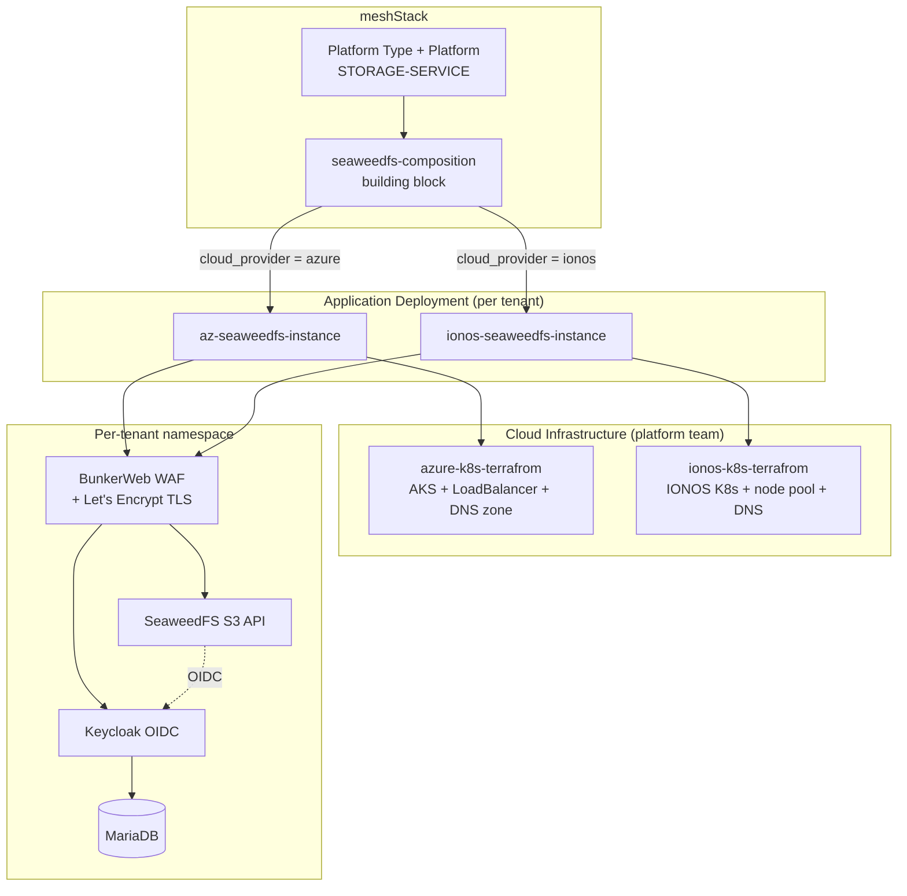

# Multi-Cloud S3 Storage Service

Self-hosted, S3-compatible object storage delivered as a **meshStack self-service building block**. A tenant orders "storage" in meshStack and gets a dedicated, namespaced deployment of **SeaweedFS** (S3 API) with **Keycloak** OIDC authentication, a **MariaDB** backend, and a **BunkerWeb** WAF with automatic Let's Encrypt TLS — on either **Azure AKS** or **IONOS Kubernetes**.

> **Note on local testing:** an earlier version of this repo was a single root Terraform module deployable to a local `kind` cluster (`s3.localhost` / `auth.localhost`, port-forwards, `test-s3.sh`). That layout has been **removed**. There is no `kind`/local path anymore — deployment happens through meshStack onto real cloud clusters. See [Development & Validation](#development--validation) for how the code is checked today.

---

## Architecture

The service is split into **cloud infrastructure**, a **cloud-agnostic application deployment**, and the **meshStack integration** that ties them together as a self-service product.


```mermaid
graph TD
    subgraph meshStack
        PT[Platform Type + Platform<br/>STORAGE-SERVICE]
        COMP[seaweedfs-composition<br/>building block]
    end

    subgraph "Cloud Infrastructure (platform team)"
        AZ[azure-k8s-terrafrom<br/>AKS + LoadBalancer + DNS zone]
        IO[ionos-k8s-terrafrom<br/>IONOS K8s + node pool + DNS]
    end

    subgraph "Application Deployment (per tenant)"
        AZI[az-seaweedfs-instance]
        IOI[ionos-seaweedfs-instance]
    end

    subgraph "Per-tenant namespace"
        BW[BunkerWeb WAF<br/>+ Let's Encrypt TLS]
        SW[SeaweedFS S3 API]
        KC[Keycloak OIDC]
        DB[(MariaDB)]
    end

    PT --> COMP
    COMP -->|cloud_provider = azure| AZI
    COMP -->|cloud_provider = ionos| IOI
    AZI --> AZ
    IOI --> IO
    AZI --> BW
    IOI --> BW
    BW --> SW
    BW --> KC
    SW -. OIDC .-> KC
    KC --> DB
```

- **`cloud_provider`** on the composition selects Azure or IONOS; only the matching instance building block is created.
- Each tenant gets its own **meshProject + meshTenant + namespace**, so deployments are isolated.
- Public endpoints (`<seaweedfs-domain>` and `<keycloak-domain>`) are exposed through BunkerWeb with real DNS records and Let's Encrypt certificates (HTTP-01 challenge on Azure, DNS-01 on IONOS).

---

## Repository Structure

```
.
├── meshstack-terraform/                    # meshStack platform type, platform & building block definitions
│
├── azure-k8s-terrafrom/                    # Azure cloud infra: AKS cluster, LoadBalancer, DNS zone
├── ionos-k8s-terrafrom/                    # IONOS cloud infra: managed K8s, node pool, DNS
│
├── modules/
│   └── buildingblocks/
│       ├── seaweedfs-composition/          # Orchestrator: creates project/tenant, calls the right instance BB
│       ├── az-seaweedfs-instance/          # Deploys SeaweedFS/Keycloak/MariaDB/BunkerWeb onto AKS
│       └── ionos-seaweedfs-instance/       # Same application deployment onto IONOS K8s
│
├── docker-compose/                         # opkssh SSH test env — OUTDATED, see note below
│
├── .pre-commit-config.yaml                 # fmt / docs / tflint / tfupdate hooks
├── .tflint.hcl                             # shared TFLint config (used by all dirs)
├── flake.nix                               # Nix dev shell (terraform/tofu, tflint, pre-commit, …)
└── README.md                               # This file
```

Each building block ships an **`APP_TEAM_README.md`** describing the tenant-facing product:
- [`seaweedfs-composition/APP_TEAM_README.md`](modules/buildingblocks/seaweedfs-composition/APP_TEAM_README.md)
- [`az-seaweedfs-instance/APP_TEAM_README.md`](modules/buildingblocks/az-seaweedfs-instance/APP_TEAM_README.md)
- [`ionos-seaweedfs-instance/APP_TEAM_README.md`](modules/buildingblocks/ionos-seaweedfs-instance/APP_TEAM_README.md)

---

## Components

| Component | Role |
|-----------|------|
| **SeaweedFS** | S3-compatible object storage; OIDC-based STS for temporary credentials |
| **Keycloak** | Identity provider (realm `seaweedfs`); issues OIDC tokens exchanged for S3 credentials |
| **MariaDB** | Database backend for Keycloak |
| **BunkerWeb** | WAF (ModSecurity/OWASP CRS), rate limiting, IP whitelisting, Let's Encrypt TLS |

### OIDC role mapping

Keycloak identities are exchanged for temporary S3 credentials via STS `AssumeRoleWithWebIdentity`; realm roles map to SeaweedFS IAM roles and bucket scopes:

| Realm role / client | SeaweedFS IAM role | Bucket access |
|---------------------|--------------------|---------------|
| `customer-1` | `Airliner1Role` | `airliner-1` (full `s3:*`) |
| `customer-2` | `Airliner2Role` | `airliner-2` (full `s3:*`) |
| admin access key | — | bucket provisioning only |

> The STS exchange must use the **ID token** (not the access token): Keycloak access tokens omit the `sub` claim SeaweedFS requires.

---

## Deployment

Deployment is driven by meshStack, not by a direct `terraform apply` at the root.

### 1. Platform team — register the product (once)

In [`meshstack-terraform/`](meshstack-terraform/): register the platform type, platform, landing zone, and the building block definitions (instance BBDs + composition BBD).

```bash
cd meshstack-terraform
tofu init
tofu apply
```

The instance building block definitions require the **admin** meshStack provider (see the aliased `meshstack.admin` provider); the rest use the normal provider.

### 2. Platform team — provide cloud infrastructure

Provision the target cluster(s) the instances deploy into:

- **Azure:** [`azure-k8s-terrafrom/`](azure-k8s-terrafrom/) — AKS cluster, LoadBalancer (public IP fronting BunkerWeb), and the DNS zone used for Let's Encrypt.
- **IONOS:** [`ionos-k8s-terrafrom/`](ionos-k8s-terrafrom/) — managed Kubernetes, node pool, and DNS.

### 3. App team — order storage (self-service)

A tenant orders the **S3 Storage Service** building block in meshStack and picks `cloud_provider` (`azure` or `ionos`). The composition then:

1. creates a dedicated **meshProject + meshTenant**,
2. instantiates the matching **instance building block** into a fresh namespace,
3. deploys SeaweedFS + Keycloak + MariaDB + BunkerWeb with DNS records and TLS,
4. returns a **Summary** output with endpoints, credentials, and quick-start commands.

No local Kubernetes, port-forwards, or `s3.localhost` are involved — endpoints are real DNS names served through BunkerWeb.

---

## Development & Validation

There is no local cluster workflow. Code is validated via **pre-commit hooks** and **CI**.

A [Nix dev shell](flake.nix) provides the toolchain (Terraform/OpenTofu, TFLint, pre-commit, terraform-docs):

```bash
nix develop
pre-commit install
pre-commit run --all-files
```

Hooks (see [`.pre-commit-config.yaml`](.pre-commit-config.yaml)):
- `terraform_fmt`, `terragrunt_fmt` — formatting
- `terraform_docs` — injects the `BEGIN_TF_DOCS` tables into each module's `README.md`
- `terraform_tflint` — lint using the shared root [`.tflint.hcl`](.tflint.hcl) (referenced via `__GIT_WORKING_DIR__`)
- `tfupdate` — aligns Terraform/provider version constraints

CI runs the same checks plus `terraform validate` — see [`.github/workflows/terraform-test.yml`](.github/workflows/terraform-test.yml).

---

## opkssh SSH testing (outdated)

The [`docker-compose/`](docker-compose/) directory contains an opkssh (OpenPubkey SSH) test harness that authenticated SSH sessions against a Keycloak reachable at `http://auth.localhost`.

**Status: not functional.** It depended on the removed local `kind` deployment (`auth.localhost`, root `terraform apply`) and has not been re-wired for the current meshStack/cloud deployment. Treat it as legacy reference material until it is either updated to point at a deployed Keycloak or removed.
