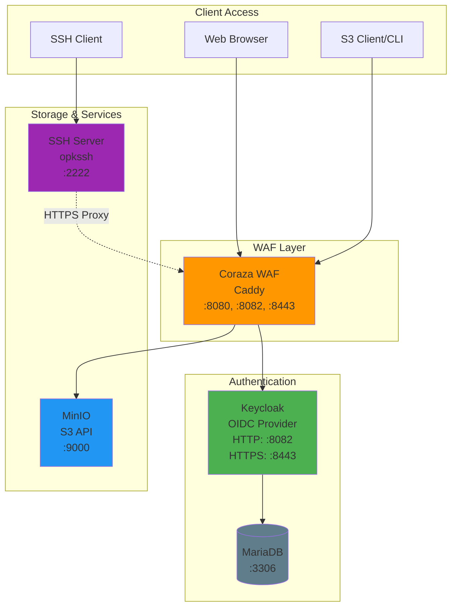

# MinIO + Keycloak + opkssh Local Development Environment

This directory contains a complete local development setup for testing MinIO with Keycloak OIDC authentication and opkssh SSH certificate-based authentication.

## 🏗️ Architecture



## 📋 Prerequisites

- Docker and Docker Compose
- macOS, Linux, or Windows with WSL2
- opkssh CLI tool (installation instructions below)

## 🚀 Quick Start

### 1. Run the Setup Script

```bash
./setup-local.sh
```

This script will:
- Build the Caddy WAF image
- Start services and generate Caddy's self-signed CA certificate
- Extract and trust the CA certificate on your system
- Start all services (MariaDB, Keycloak, MinIO, WAF, SSH server)

**Note:** You'll be prompted for your sudo password to trust the certificate.

### 2. Install opkssh

**macOS:**
```bash
brew tap openpubkey/opkssh
brew install opkssh
```

**Linux:**
```bash
curl -L https://github.com/openpubkey/opkssh/releases/latest/download/opkssh-linux-amd64 -o opkssh
chmod +x opkssh
sudo mv opkssh /usr/local/bin/
```

**Windows:**
```powershell
curl https://github.com/openpubkey/opkssh/releases/latest/download/opkssh-windows-amd64.exe -o opkssh.exe
```

### 3. Login with opkssh

```bash
opkssh login --provider="https://localhost:8443/realms/minio_realm,opkssh-client"
```

This will:
- Open your browser to Keycloak login
- Use credentials: `test@test.com` / `test`
- Generate an SSH certificate valid for 24 hours

### 4. SSH to Test Server

```bash
ssh -p 2222 testuser@localhost
```

You should be logged in **without a password** using your OIDC identity!

## 🌐 Service Endpoints

| Service | URL | Credentials |
|---------|-----|-------------|
| MinIO Console | http://localhost:8080 | minioadmin / minioadmin |
| MinIO API | http://localhost:8081 | - |
| Keycloak (HTTP) | http://localhost:8082 | admin / admin |
| Keycloak (HTTPS) | https://localhost:8443 | admin / admin |
| SSH Server | ssh://localhost:2222 | opkssh certificate |

## 📁 Directory Structure

```
docker-compose/
├── setup-local.sh              # Local setup script
├── setup-azure-config.sh       # Azure configuration helper
├── docker-compose.yml          # Main local services
├── docker-compose.external-test.yml  # External Azure testing
├── Dockerfile.ssh-server       # Local SSH server with opkssh
├── Dockerfile.ssh-external-test # External SSH server for Azure
├── docker-entrypoint.sh        # SSH server startup script
├── Caddyfile.local            # Caddy WAF configuration
├── minio-realm-config.json    # Keycloak realm import
├── opk-providers-local/       # opkssh config for local dev
│   └── providers
├── opk-auth_id-local/         # opkssh auth mapping for local
│   └── auth_id
├── opk-providers-azure/       # opkssh config for Azure (gitignored content)
│   └── providers
├── opk-auth_id-azure/         # opkssh auth mapping for Azure (gitignored content)
│   └── auth_id
└── TESTING-OPKSSH.md          # Detailed opkssh testing guide
```

## 🔧 Configuration Files

### Local Configuration (opk-*-local/)

Used by `docker-compose.yml` for local development:
- **Issuer:** `https://localhost:8443/realms/minio_realm`
- **Test user:** `test@test.com` → Linux user `testuser`

These files are committed to the repository.

### Azure Configuration (opk-*-azure/)

Used by `docker-compose.external-test.yml` for testing against Azure deployment:
- **Issuer:** `https://<YOUR-FQDN>:8444/realms/minio_realm`
- **Test user:** `test@test.com` → Linux user `testuser`

**Important:** These files contain your Azure FQDN and are **gitignored**. Use the helper script to configure them:

```bash
./setup-azure-config.sh testminio.germanywestcentral.cloudapp.azure.com
```

## 🧪 Testing Against Azure

### 1. Configure Azure Settings

```bash
./setup-azure-config.sh <YOUR-AZURE-FQDN> [PORT]
# Example:
./setup-azure-config.sh testminio.germanywestcentral.cloudapp.azure.com 8444
```

### 2. Copy Azure Certificate

```bash
# Copy the certificate from your Azure deployment
cp /path/to/azure-cert.pem ./minio-cert.pem
```

### 3. Start External Test SSH Server

```bash
docker-compose -f docker-compose.external-test.yml up -d
```

### 4. Login with Azure Keycloak

```bash
opkssh login --provider="https://<YOUR-FQDN>:8444/realms/minio_realm,opkssh-client"
```

### 5. SSH to External Test Server

```bash
ssh -p 2223 testuser@localhost
```

**Note:** The external test server runs on port **2223** (not 2222) to avoid conflicts with local testing.

## 🔐 Security Notes

### TLS Certificates

- **Local:** Uses Caddy's auto-generated self-signed certificate
- **Azure:** Requires your Azure deployment's certificate as `minio-cert.pem`
- Certificates (`*.crt`, `*.pem`, `*.key`) are **gitignored** for security

### opkssh Certificate Management

- SSH certificates expire after **24 hours**
- Re-run `opkssh login` daily to refresh
- No long-lived SSH keys needed - better security!

### Keycloak Default Credentials

**Change these in production:**
- Admin: `admin` / `admin`
- Test user: `test@test.com` / `test`

## 🛠️ Common Operations

### View Logs

```bash
# All services
docker-compose logs -f

# Specific service
docker-compose logs -f ssh-server
docker-compose logs -f keycloak
```

### Restart Services

```bash
# All services
docker-compose restart

# Specific service
docker-compose restart ssh-server
```

### Stop Services

```bash
docker-compose down
```

### Rebuild SSH Server

```bash
docker-compose build ssh-server
docker-compose up -d ssh-server
```

### Reset Everything

```bash
# Stop and remove all containers, volumes
docker-compose down -v

# Remove generated certificate
rm -f caddy-root-ca.crt

# Run setup again
./setup-local.sh
```

## 🐛 Troubleshooting

### SSH Authentication Fails

**Check your certificate:**
```bash
ssh-keygen -L -f ~/.ssh/id_ecdsa-cert.pub
```

Look for:
- **Valid:** Should show current time to expiration
- **Principals:** Should be empty (opkssh handles this)

**Re-login if expired:**
```bash
opkssh login --provider="https://localhost:8443/realms/minio_realm,opkssh-client"
```

### TLS Certificate Not Trusted

**macOS:**
```bash
# Re-run certificate installation
sudo security add-trusted-cert -d -r trustRoot -k /Library/Keychains/System.keychain ./caddy-root-ca.crt
```

**Linux:**
```bash
sudo cp ./caddy-root-ca.crt /usr/local/share/ca-certificates/
sudo update-ca-certificates
```

### Services Not Starting

**Check service status:**
```bash
docker-compose ps
```

**View error logs:**
```bash
docker-compose logs
```

### Permission Denied on SSH

**Check opk config file permissions:**
```bash
docker exec ssh-test-server ls -la /etc/opk/
```

Both files should be `640` (rw-r-----) owned by `opksshuser`.

The entrypoint script fixes this automatically, but if issues persist:
```bash
docker-compose restart ssh-server
```

### Cannot Connect to Keycloak

**Verify Keycloak is running:**
```bash
curl http://localhost:8082/realms/minio_realm/.well-known/openid-configuration
```

**Verify HTTPS works:**
```bash
curl https://localhost:8443/realms/minio_realm/.well-known/openid-configuration
```

### opkssh verify Fails in Container

**Test manually:**
```bash
docker exec ssh-test-server /usr/local/bin/opkssh verify testuser "$(cat ~/.ssh/id_ecdsa-cert.pub)" ecdsa-sha2-nistp256
```

Common errors:
- **Policy file permissions:** Fixed by entrypoint script
- **Certificate not trusted:** Certificate should be auto-installed on startup
- **Cannot reach Keycloak:** Check socat proxy is running

## 📚 Additional Documentation

- [TESTING-OPKSSH.md](./TESTING-OPKSSH.md) - Detailed opkssh setup and testing guide
- [opkssh GitHub](https://github.com/openpubkey/opkssh) - Official opkssh documentation
- [Keycloak Docs](https://www.keycloak.org/documentation) - Keycloak configuration

## 🤝 Contributing

When modifying the setup:

1. **Never commit certificates:**
   - `*.crt`, `*.pem`, `*.key` are gitignored
   - `caddy-root-ca.crt` is generated locally

2. **Keep Azure configs separate:**
   - `opk-*-azure/` folder structure is committed
   - File **contents** with Azure FQDNs are gitignored
   - Use `setup-azure-config.sh` to generate them

3. **Test both environments:**
   - Local: `docker-compose up`
   - External: `docker-compose -f docker-compose.external-test.yml up`

## 🎯 What's Next?

- ✅ Test MinIO OIDC login via web console
- ✅ Test opkssh SSH certificate authentication
- ✅ Add additional Keycloak users
- ✅ Configure group-based access control
- 🚀 Deploy to Azure using Terraform in parent directory
